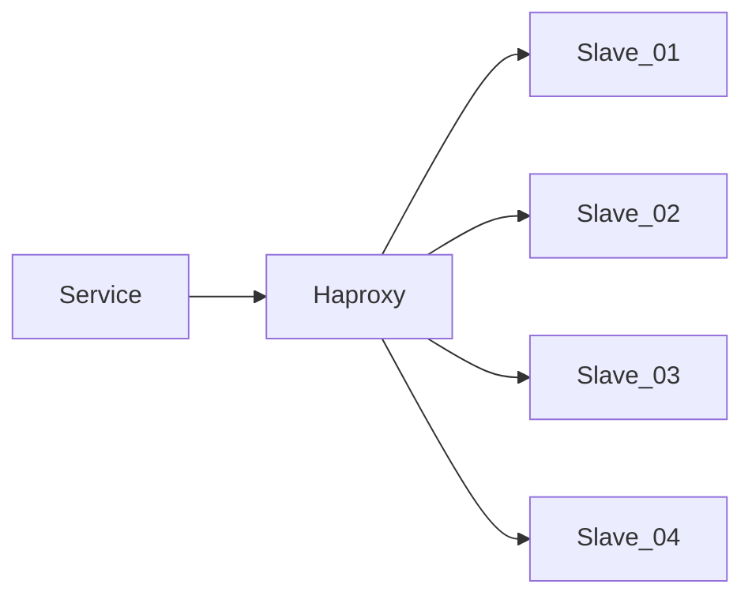

> 在1-2周内完成   
> 如果有任何疑问，欢迎随时来信联系   
> 难免谬误，敬请指正，友好交流   
>   
> v2渠道的候选人，直接回复到应聘邮件里面即可   
> 其它渠道的候选人在完成后请发送到下面邮箱：   
```
Subject: 2024Q2 PHP工程师 笔试回复 | {招聘渠道} | {姓名 所在城市}
To: tanwei@housesigma.com
```

一、使用PHP语言, 实现一个API限流器[RateLimiter]，要求如下:
  - 限制请求对象可以是全局或者某一特定对象，比如用户ID;
  - 至少实现两种常见的限流策略，并支持继续扩展;
  - 支持使用File或Redis作为存储系统，并支持继续扩展;
  - 完成后请补充该类库的用法文档和结构设计图;
  - 如要需要支持通过Composer安装，请写出具体步骤;

二、现通过MySQL数据库存储所有房产数据和内容，随着房产信息的增长，数据库的查询性能问题开始显现。你需要对现有的数据库架构和查询进行优化，以提高系统的整体性能。
  - 系统种最常用的查询之一是获取特定的房产数据, 该查询用于根据 house_id 和 type 获取最新的数据。
```
SELECT * FROM houses WHERE house_id = 123 and type = 'A' ORDER BY created_at DESC LIMIT 10;
```
  - houses 表包含超过1000万条记录，house_id | type 列已经建立了索引;
  - 因为房产信息相对复杂，单表字段总数已经超过100+，且大部分为文本;
  - 请描述如何评估现有索引的有效性，并提出可能的优化方案;
  - 请提供可能的优化方案，以提高查询效率;
  - 考虑到数据量的增长，提出优化策略，以维持查询性能;

三、在生产环境中，应用程序是通过Haproxy来读取Slave集群，但是偶尔会产生 **SQLSTATE[HY000]: General error: 2006 MySQL server has gone away** 的错误，请根据经验，给出排查方案与可能的方向，现已经排查：
  - 故障发生时，服务器之间防火墙正常，服务器之间可以正常通信;
  - 故障SQL均可以正常查询，同时不存在性能问题;
  - 故障频率没有发现特别规律，与服务器负载没有正相关;
  - 查看各服务的日志，只发现了错误信息，但没有进一步的说明;



四、你在工作中一定遇到过许多技术挑战和有趣的项目。请描述一个给你留下深刻印象的工程实现或项目开发经历。
  - 简要介绍项目的背景、目标和重要性; 项目团队的组成和你在项目中扮演的角色;
  - 详细说明在项目中遇到的主要技术挑战或难题，以及它对项目进度和最终结果的潜在影响;
  - 请通过图文方式描述实现解决方案的具体技术细节;
  - 分享一下你在这个过程中学习到的经验或教训;
