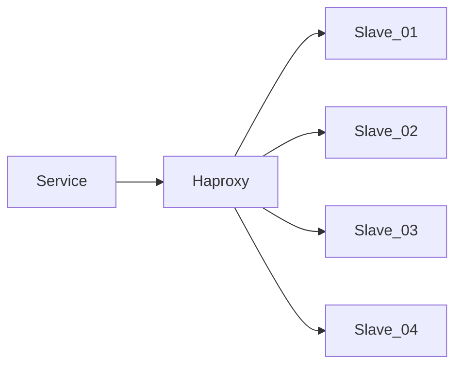

> 在一周内完成并回复简历投递邮件  
> 请尽量作答，难免谬误，敬请指正  
> 如果有任何疑问，欢迎随时来信联系    


一、写一个定时执行的Bash脚本，**每月的一号凌晨1点** 对 MongoDB 中 test.user_logs 表进行备份、清理
  - 首先备份上个月的数据，备份完成后打包成.gz文件
  - 备份文件通过sfpt传输到 **Backup [bak@bak.ipo.com]** 服务器上，账户已经配置在~/.ssh/config;
  - 备份完成后，再对备份过的数据进行清理: **create_on [2024-01-01 03:33:11]** ;
  - 如果脚本执行失败或者异常，则调用 [https://monitor.ipo.com/webhook/mongodb ];
  - 这个表每日数据量大约在 **200w** 条, 单条数据未压缩的存储大小约 **200B**;
```
我的作答：
#!/bin/bash
# 设置日期变量
LAST_MONTH=$(date --date='1 month ago' +%Y-%m)
BACKUP_DIR="/path/to/backup"
BACKUP_FILE="user_logs_${LAST_MONTH}.gz"
BACKUP_PATH="${BACKUP_DIR}/${BACKUP_FILE}"
MONGO_URI="mongodb://localhost:27017"
DB_NAME="test"
COLLECTION_NAME="user_logs"
WEBHOOK_URL="https://monitor.ipo.com/webhook/mongodb"
SFTP_SERVER="bak@bak.ipo.com"
SFTP_DEST_DIR="/path/on/remote/server"

# 创建备份目录（如果不存在）
mkdir -p $BACKUP_DIR

# 备份数据并压缩
echo "开始备份 ${DB_NAME}.${COLLECTION_NAME} 表..."
mongodump --uri="$MONGO_URI" --db="$DB_NAME" --collection="$COLLECTION_NAME" --query='{ "create_on": { "$gte": { "$date": "2023-12-01 00:00:00.000" }, "$lt": { "$date": "2024-01-01 00:00:00.000" } } }' --out="$BACKUP_DIR" >/dev/null 2>&1
if [ $? -ne 0 ]; then
  echo "备份失败" | tee -a /var/log/mongo_backup.log
  curl -X POST "$WEBHOOK_URL" -H 'Content-Type: application/json' -d '{"status": "failure", "message": "Backup failed"}'
  exit 1
fi

# 压缩备份文件
tar -czf "$BACKUP_PATH" "$BACKUP_DIR/dumpfile"
if [ $? -ne 0 ]; then
  echo "压缩失败" | tee -a /var/log/mongo_backup.log
  curl -X POST "$WEBHOOK_URL" -H 'Content-Type: application/json' -d '{"status": "failure", "message": "Compression failed"}'
  exit 1
fi

# SFTP传输备份文件到远程服务器
echo "传输备份文件到远程服务器..."
sftp "$SFTP_SERVER" <<EOF
put "$BACKUP_PATH" "$SFTP_DEST_DIR/"
EOF
if [ $? -ne 0 ]; then
  echo "SFTP 传输失败" | tee -a /var/log/mongo_backup.log
  curl -X POST "$WEBHOOK_URL" -H 'Content-Type: application/json' -d '{"status": "failure", "message": "SFTP transfer failed"}'
  exit 1
fi

# 清理备份的旧数据
echo "清理备份过的数据..."
mongo --eval 'db.user_logs.remove({ "create_on": { "$lt": ISODate("2024-01-01T03:33:11.000Z") } })' $DB_NAME
if [ $? -ne 0 ]; then
  echo "数据清理失败" | tee -a /var/log/mongo_backup.log
  curl -X POST "$WEBHOOK_URL" -H 'Content-Type: application/json' -d '{"status": "failure", "message": "Data cleanup failed"}'
  exit 1
fi

# 删除本地备份文件
rm -rf "$BACKUP_PATH" "$BACKUP_DIR/dumpfile"
echo "备份和清理完成"

#给脚本执行权限
chmod +x /path/to/mongo_backup.sh

#设置定时任务
crontab -e //增加如下定时任务
0 1 1 * * /path/to/mongo_backup.sh

#验证
bash /path/to/mongo_backup.sh
#检查日志文件 /var/log/mongo_backup.log
```

二、根据要求提供一份Nginx配置：
  - 域名：ipo.com, 支持https、HTTP/2
  - 非http请求经过301重定向到https
  - 根据UA进行判断，如果包含关键字 **"Google Bot"**, 反向代理到 server_bot[bot.ipo.com] 去处理
  - /api/{name} 路径的请求通过**unix sock**发送到本地 **php-fpm**，文件映射 **/www/api/{name}.php** 
  - /api/{name} 路径下需要增加限流设置，只允许每秒1.5个请求，超过限制的请求返回 **http code 429**
  - /static/ 目录下是纯静态文件
  - 其它请求指向目录 **/www/ipo/**, 查找顺序 index.html --> public/index.html --> /api/request
```
我的作答：
# Nginx configuration for ipo.com
# HTTP server for redirection to HTTPS
server {
    listen 80;
    server_name ipo.com www.ipo.com;
    
    # Redirect all HTTP requests to HTTPS
    return 301 https://$host$request_uri;
}

# HTTPS server with HTTP/2 support
server {
    listen 443 ssl http2;
    server_name ipo.com www.ipo.com;

    # SSL configuration
    ssl_certificate /etc/nginx/ssl/ipo.com.crt;
    ssl_certificate_key /etc/nginx/ssl/ipo.com.key;
    ssl_protocols TLSv1.2 TLSv1.3;
    ssl_ciphers 'TLS_AES_128_GCM_SHA256:TLS_AES_256_GCM_SHA384:ECDHE-RSA-AES128-GCM-SHA256:ECDHE-RSA-AES256-GCM-SHA384';
    ssl_prefer_server_ciphers on;
    ssl_session_cache shared:SSL:10m;
    ssl_session_timeout 5m;

    # Root directory
    root /www/ipo;

    # Default index files
    index index.html public/index.html /api/request;

    # Location block for Google Bot
    location / {
        if ($http_user_agent ~* "Google Bot") {
            proxy_pass http://bot.ipo.com;
            proxy_set_header Host $host;
            proxy_set_header X-Real-IP $remote_addr;
            proxy_set_header X-Forwarded-For $proxy_add_x_forwarded_for;
            proxy_set_header X-Forwarded-Proto $scheme;
            break;
        }
    }

    # Location block for API requests with rate limiting
    location ~ ^/api/([^/]+)$ {
        limit_req zone=api_per_ip burst=5 nodelay;
        try_files /www/api/$1.php =404;
        include fastcgi_params;
        fastcgi_pass unix:/run/php/php7.4-fpm.sock;
        fastcgi_param SCRIPT_FILENAME /www/api/$1.php;
    }

    # Rate limiting configuration
    limit_req_zone $binary_remote_addr zone=api_per_ip:10m rate=1.5r/s;

    # Location block for static files
    location /static/ {
        alias /www/static/;
        expires 30d;
        access_log off;
    }

    # Default location block for other requests
    location / {
        try_files $uri $uri/ =404;
    }

    # Custom error page for 429
    error_page 429 /error_pages/429.html;
    location = /error_pages/429.html {
        root /www/ipo;
    }
}
```

三、在生产环境中，应用程序是通过Haproxy来读取Slave集群，但是偶尔会产生 **SQLSTATE[HY000]: General error: 2006 MySQL server has gone away** 的错误，请根据经验，给出一排查方案与可能的方向，与开发一起定位问题, 现已经排查：
  - 故障发生时，服务器之间防火墙正常，服务器之间可以正常通信;
  - 故障SQL均可以正常查询，同时不存在性能问题;
  - 故障频率没有发现特别规律，与服务器负载没有正相关;
  - 查看各服务的日志，只发现了错误信息，但没有进一步的说明;


```
我的作答：
因为不存在防火墙问题 mysql性能问题 以及服务器负载也不正相关，因此可能的排查思路：
1 查看mysql服务器及mysql各项指标监控及日志，以及业务日志，看有没有相应的报错
2 检查mysql这两个参数的设置 wait_timeout 和 interactive_timeout
这些参数控制 MySQL 连接的超时。如果应用程序连接空闲时间超过了这个超时设置，连接可能会被 MySQL 关闭。
如果排查和这两个参数相关，可以增加 wait_timeout 和 interactive_timeout 的值。
检查方法:
SHOW VARIABLES LIKE 'wait_timeout';
SHOW VARIABLES LIKE 'interactive_timeout';

以及max_allowed_packet参数的设置，这个参数是 MySQL 允许的最大数据包大小。如果你的应用发送了超大数据包，可能会导致连接丢失，可以适当增大。

3 检查mysql最大连接数
MySQL 的最大连接数限制也可能导致连接丢失。
检查方法:
SHOW VARIABLES LIKE 'max_connections';

4 检查应用程序配置
应用程序数据库连接池设置
应用程序的数据库连接池设置可能导致连接池中连接的超时设置不当。检查应用程序的数据库连接池配置，确保连接池的超时设置合理。

5 网络稳定性
网络问题（如连接丢失、延迟）可能导致 MySQL 连接断开。可以从应用侧持续ping mysql服务器,看是否有丢包或延迟增大的情况。

6 检查 HAProxy 配置及日志
HAProxy 的超时设置可能会影响到连接的持久性。确保 HAProxy 的超时设置足够长。
7 如果都不是上面这些问题导致，可以在问题发生时 用tcpdump 抓包分析，因为是偶然出现，可以在后台起一个screen 同时 ping 及tcpdump 抓包。
```
四、有一个简单的三层 Web 应用，包含前端（frontend）、中间层（backend），和数据库（database）三部分。这些应用都已经打包成 Docker 镜像，现在需要部署在 Kubernetes 中。
该集群是一个全新部署的集群，除了 kube-proxy, CoreDNS, CNI (Calico) 外没有部署任何应用。请根据下面的要求分别提供部署所需的所有 yaml 定义及部署说明，可以使用 helm 等工具。

具体要求如下：

    1. 前端服务（frontend）：
     - 需要通过外部域名：frontend.example.com访问并支持 https，可以self-signed
     - 支持自动扩缩容，根据 CPU (80%) 使用率在 2 到 10 个 Pod 之间调整实例数量
     - 该 Pod 需要配置 health check, HTTP 协议 9090 端口

    2. 中间层服务（backend）：
    - 仅供前端服务调用，不能对外部暴露
    - 支持通过环境变量来配置对 database 的访问，ENV KEY: DB_HOST/DB_NAME/DB_USER/DB_PASS...
    - 为了保证高可用性，至少要有 3个Pod 同时存活，同时需要 **尽可能** 避免多个 Pod 运行在同一个 Node 上

    3. 数据库服务（database）：
    - 数据库只允许中间层服务访问，不能通过 ClusterIP 之外的方式暴露
    - 需要考虑持久化问题，数据存储在 /var/lib/mysql 目录下, 确保 Pod 崩溃或重建后数据不丢失

  ```
我的作答：
创建helm chart
一, 前端服务（frontend）
前端服务的 Helm Chart
首先，创建一个 Helm Chart 来管理前端服务的部署。假设 Helm Chart 的结构如下：

frontend-chart/
  Chart.yaml
  values.yaml
  templates/
    deployment.yaml
    service.yaml
    ingress.yaml
    hpa.yaml
    secret.yaml
#cat Chart.yaml
apiVersion: v2
name: frontend-chart
description: A Helm chart for frontend service
version: 0.1.0
#cat values.yaml
replicaCount: 2
image:
  repository: your-repo/frontend
  tag: latest
  pullPolicy: IfNotPresent
service:
  type: ClusterIP
  port: 9090
  targetPort: 9090
ingress:
  enabled: true
  name: frontend-ingress
  path: /
  hosts:
    - host: frontend.example.com
      paths:
        - /
  tls:
    - secretName: frontend-tls
      hosts:
        - frontend.example.com
resources: {}
autoscaling:
  enabled: true
  minReplicas: 2
  maxReplicas: 10
  targetCPUUtilizationPercentage: 80
#cat templates/deployment.yaml
apiVersion: apps/v1
kind: Deployment
metadata:
  name: frontend
spec:
  replicas: {{ .Values.replicaCount }}
  selector:
    matchLabels:
      app: frontend
  template:
    metadata:
      labels:
        app: frontend
    spec:
      containers:
        - name: frontend
          image: "{{ .Values.image.repository }}:{{ .Values.image.tag }}"
          imagePullPolicy: {{ .Values.image.pullPolicy }}
          ports:
            - containerPort: {{ .Values.service.port }}
          livenessProbe:
            httpGet:
              path: /health
              port: {{ .Values.service.port }}
          readinessProbe:
            httpGet:
              path: /health
              port: {{ .Values.service.port }}

#cat templates/service.yaml
apiVersion: v1
kind: Service
metadata:
  name: frontend
spec:
  type: LoadBalancer
  ports:
    - port: {{ .Values.service.port }}
      targetPort: {{ .Values.service.targetPort }}
  selector:
    app: frontend

#cat templates/ingress.yaml
apiVersion: networking.k8s.io/v1
kind: Ingress
metadata:
  name: {{ .Values.ingress.name }}
  annotations:
    nginx.ingress.kubernetes.io/rewrite-target: /
spec:
  rules:
    - host: {{ .Values.ingress.hosts[0].host }}
      http:
        paths:
          - path: {{ .Values.ingress.path }}
            pathType: Prefix
            backend:
              service:
                name: frontend
                port:
                  number: {{ .Values.service.port }}
  tls:
    - hosts:
        - {{ .Values.ingress.tls[0].hosts[0] }}
      secretName: {{ .Values.ingress.tls[0].secretName }}
#cat templates/hpa.yaml
apiVersion: autoscaling/v2beta2
kind: HorizontalPodAutoscaler
metadata:
  name: frontend-hpa
spec:
  scaleTargetRef:
    apiVersion: apps/v1
    kind: Deployment
    name: frontend
  minReplicas: {{ .Values.autoscaling.minReplicas }}
  maxReplicas: {{ .Values.autoscaling.maxReplicas }}
  targetCPUUtilizationPercentage: {{ .Values.autoscaling.targetCPUUtilizationPercentage }}


#cat templates/secret.yaml
apiVersion: v1
kind: Secret
metadata:
  name: frontend-tls
type: kubernetes.io/tls
data:
  tls.crt: <base64-encoded-cert>
  tls.key: <base64-encoded-key>

#由于集群是全新的，确保你在集群中部署了支持 HTTPS 的 Ingress Controller（如 NGINX Ingress Controller）：
kubectl apply -f https://raw.githubusercontent.com/kubernetes/ingress-nginx/main/deploy/static/provider/cloud/deploy.yaml

二, 中间层服务（backend）
中间层服务的 Helm Chart
创建一个 Helm Chart 来管理中间层服务的部署。

#cat Chart.yaml
apiVersion: v2
name: backend-chart
description: A Helm chart for backend service
version: 0.1.0

#cat values.yaml
replicaCount: 3
image:
  repository: your-repo/backend
  tag: latest
  pullPolicy: IfNotPresent
service:
  type: ClusterIP
  port: 8080
  targetPort: 8080
affinity: {}
resources: {}
env:
  DB_HOST: database
  DB_NAME: mydb
  DB_USER: user
  DB_PASS: password


#cat templates/deployment.yaml
apiVersion: apps/v1
kind: Deployment
metadata:
  name: backend
spec:
  replicas: {{ .Values.replicaCount }}
  selector:
    matchLabels:
      app: backend
  template:
    metadata:
      labels:
        app: backend
    spec:
      affinity:
        podAntiAffinity:
          requiredDuringSchedulingIgnoredDuringExecution:
            - labelSelector:
                matchExpressions:
                  - key: app
                    operator: In
                    values:
                      - backend
              topologyKey: kubernetes.io/hostname
      containers:
        - name: backend
          image: "{{ .Values.image.repository }}:{{ .Values.image.tag }}"
          imagePullPolicy: {{ .Values.image.pullPolicy }}
          ports:
            - containerPort: {{ .Values.service.port }}
          env:
            - name: DB_HOST
              value: {{ .Values.env.DB_HOST }}
            - name: DB_NAME
              value: {{ .Values.env.DB_NAME }}
            - name: DB_USER
              value: {{ .Values.env.DB_USER }}
            - name: DB_PASS
              value: {{ .Values.env.DB_PASS }}


#cat templates/service.yaml
apiVersion: v1
kind: Service
metadata:
  name: backend
spec:
  type: ClusterIP
  ports:
    - port: {{ .Values.service.port }}
      targetPort: {{ .Values.service.targetPort }}
  selector:
    app: backend
三， 数据库服务（database）
数据库服务的 Helm Chart
创建一个 Helm Chart 来管理数据库服务的部署。

#cat Chart.yaml
apiVersion: v2
name: database-chart
description: A Helm chart for database service
version: 0.1.0


#cat values.yaml
replicaCount: 1
image:
  repository: mysql
  tag: 8.0
  pullPolicy: IfNotPresent
service:
  type: ClusterIP
  port: 3306
persistence:
  enabled: true
  storageClass: "default"
  accessModes:
    - ReadWriteOnce
  size: 10Gi
env:
  MYSQL_ROOT_PASSWORD: rootpassword
  MYSQL_DATABASE: mydb
  MYSQL_USER: user
  MYSQL_PASSWORD: password

#cat templates/deployment.yaml
apiVersion: apps/v1
kind: Deployment
metadata:
  name: database
spec:
  replicas: {{ .Values.replicaCount }}
  selector:
    matchLabels:
      app: database
  template:
    metadata:
      labels:
        app: database
    spec:
      containers:
        - name: mysql
          image: "{{ .Values.image.repository }}:{{ .Values.image.tag }}"
          imagePullPolicy: {{ .Values.image.pullPolicy }}
          ports:
            - containerPort: 3306
          env:
            - name: MYSQL_ROOT_PASSWORD
              value: {{ .Values.env.MYSQL_ROOT_PASSWORD }}
            - name: MYSQL_DATABASE
              value: {{ .Values.env.MYSQL_DATABASE }}
            - name: MYSQL_USER
              value: {{ .Values.env.MYSQL_USER }}
            - name: MYSQL_PASSWORD
              value: {{ .Values.env.MYSQL_PASSWORD }}
          volumeMounts:
            - name: mysql-storage
              mountPath: /var/lib/mysql
      volumes:
        - name: mysql-storage
          persistentVolumeClaim:
            claimName: mysql-pvc

#cat templates/service.yaml
apiVersion: v1
kind: Service
metadata:
  name: database
spec:
  type: ClusterIP
  ports:
    - port: 3306
  selector:
    app: database


#cat templates/pvc.yaml
apiVersion: v1
kind: PersistentVolumeClaim
metadata:
  name: mysql-pvc
spec:
  accessModes:
    - ReadWriteOnce
  resources:
    requests:
      storage: {{ .Values.persistence.size }}
  storageClassName: {{ .Values.persistence.storageClass }}

部署 Helm Chart
1 创建 Helm Chart
将上述文件保存到一个目录(例如 frontend-chart，backend-chart, database-chart)，并在该目录中运行以下命令以安装 Helm Chart：
helm install frontend ./frontend-chart
helm install backend ./backend-chart
helm install database ./database-chart
2 验证部署 确保所有资源都正确创建
kubectl get all -A -owide
 ```
