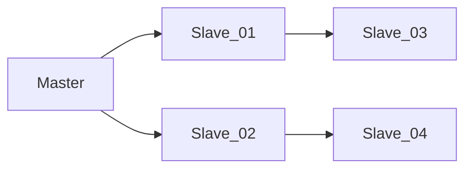
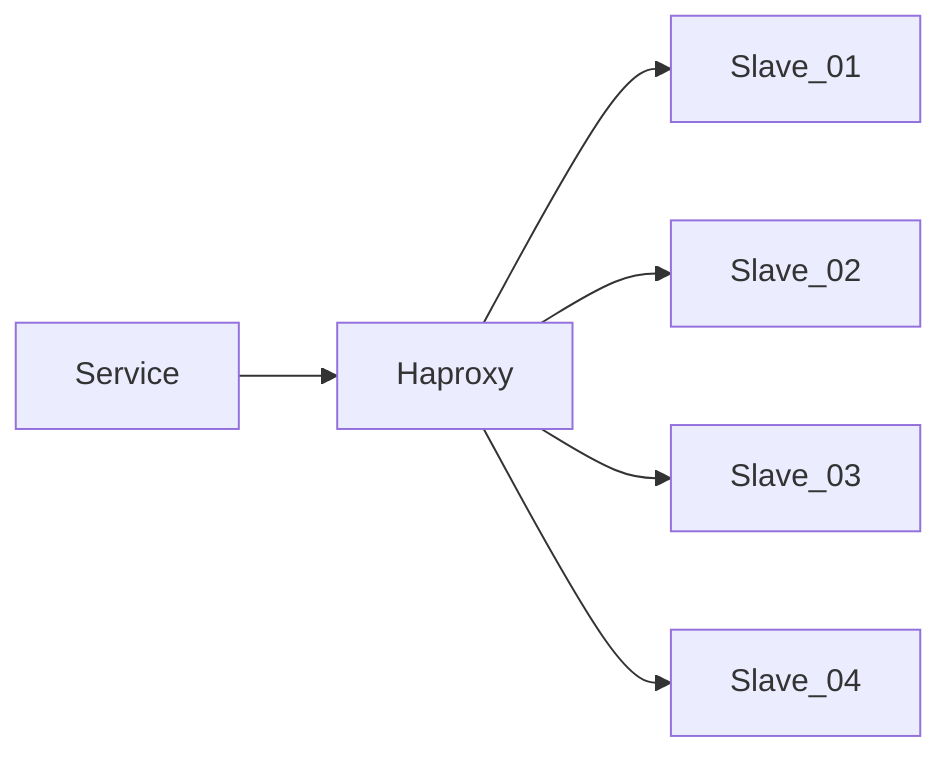

> 在一周内完成即可  
> 如果有任何疑问，随时来信联系   
> 系统：Rocky 8   

一、写一个定时执行的Bash脚本，**每月的一号凌晨1点** 对 MongoDB 中 test.user_logs 表进行备份、清理
  - 首先备份上个月的数据，备份完成后打包成.gz文件
  - 备份文件通过sfpt传输到 **Backup [bak@bak.ipo.com]** 服务器上，账户已经配置在~/.ssh/config;
  - 备份完成后，再对备份过的数据进行清理: **create_on [2024-01-01 03:33:11]** ;
  - 如果脚本执行失败或者异常，则调用 [https://monitor.ipo.com/webhook/mongodb ];
  - 这个表每日数据量大约在 **200w** 条, 单条数据未压缩的存储大小约 **200B**;

二、根据要求提供一份Nginx配置：
  - 域名：ipo.com, 支持https、HTTP/2
  - 非http请求经过301重定向到https
  - 根据UA进行判断，如果包含关键字 **"Google Bot"**, 反向代理到 server_bot[bot.ipo.com] 去处理
  - /api/{name} 路径的请求通过**unix sock**发送到本地 **php-fpm**，文件映射 **/www/api/{name}.php** 
  - /api/{name} 路径下需要增加限流设置，只允许每秒1.5个请求，超过限制的请求返回 **http code 429**
  - /static/ 目录下是纯静态文件，需要做一些优化配置
  - 其它请求指向目录 **/www/ipo/**, 查找顺序 index.html --> public/index.html --> /api/landing

三、现有一台服务器，上面运行了3个docker容器服务，需要通过iptables进行网络配置。请给出命令：
  - 只有Docker_A 与 Docker_B 之间可以相互通信，Docker_C 不能访问其它两个容器;
  - 只允许内网IP为 192.168.1.1 - 192.168.1.30 的内网IP访问所有容器;
  - Docker_A:8080 与 Docker_C:80 通过相同端口对外网提供服务, Docker_B:3316 不对外网提供服务;
  - 所有配置需要固化，重启服务器自动生效;

四、已知生产环境数据库结构如图所示，因为master服务器偶尔有硬件问题，需要先将slave_01提升为新master, 然后旧master变成slave_01。请给出操作方案和关键命令。
  - 主从数据库服务均处于独立服务器上，有独立的IP;
  - 应用程序写入数据库通过域名[mysql-master.ipo.com]访问;
  - 应用程序读取数据通过**Haproxy**[mysql-slave.ipo.com]访问所有从库[01-04];
  - 尽量平滑处理，不影响生产环境;

五、在生产环境中，应用程序是通过Haproxy来读取Slave集群，但是偶尔会产生 **SQLSTATE[HY000]: General error: 2006 MySQL server has gone away** 的错误，请根据经验，给出一排查方案与可能的方向，与开发一起定位问题, 现已经排查：
  - 故障发生时，服务器之间防火墙正常，服务器之间可以正常通信;
  - 故障SQL均可以正常查询，同时不存在性能问题;
  - 故障频率没有发现特别规律，与服务器负载没有正相关;
  - 查看各服务的日志，只发现了错误信息，但没有进一步的说明;

